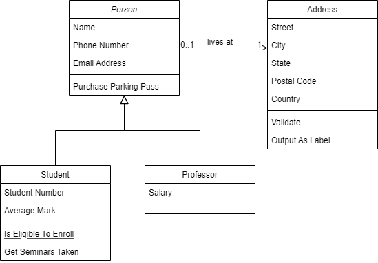
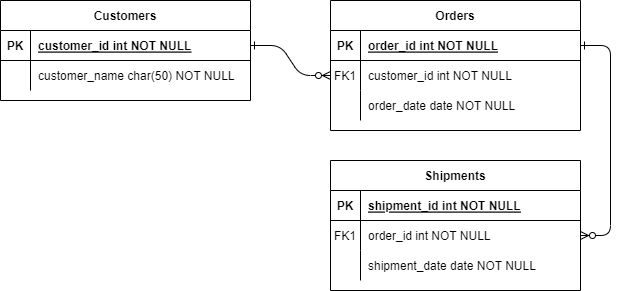

# sleepy-bears
We are bears and we are sleepy, all the time.

Project used for the Software engineering team project.

<h1>Use Case diagram</h1>

<h1>Application architecture diagram</h1>

<h1>Database ERD</h1>

<svg xmlns="http://www.w3.org/2000/svg" xmlns:xlink="http://www.w3.org/1999/xlink" version="1.1" width="7" height="7" viewBox="-0.5 -0.5 7 7" content="&lt;mxfile host=&quot;app.diagrams.net&quot; modified=&quot;2022-03-09T08:25:36.535Z&quot; agent=&quot;5.0 (Windows NT 10.0; Win64; x64) AppleWebKit/537.36 (KHTML, like Gecko) Chrome/99.0.4844.51 Safari/537.36&quot; etag=&quot;8eUWdtGA_9k_g7Krz8V5&quot; version=&quot;17.0.0&quot;&gt;&lt;diagram id=&quot;oIdcUuD8mp2mcNENbyUb&quot; name=&quot;Page-1&quot;&gt;ddG9DoMgEADgp2FHqEl3a9ulk0NnIlchQc8gRtunLwasJbYLOb47OH4IL9r5YkWvbijBEEblTPiJMHakuR8XeAY45BEaq2WgbINKvyAijTpqCUNS6BCN032KNXYd1C4xYS1OadkDTdq1Fw3soKqF2etdS6fitXK6+RV0o9bOGY2ZVqzFEQYlJE5fxEvCC4voQtTOBZjl7dZ3CevOf7Kfg1no3I8FPtj29pPkg3j5Bg==&lt;/diagram&gt;&lt;/mxfile&gt;" onclick="(function(svg){var src=window.event.target||window.event.srcElement;while (src!=null&amp;&amp;src.nodeName.toLowerCase()!='a'){src=src.parentNode;}if(src==null){if(svg.wnd!=null&amp;&amp;!svg.wnd.closed){svg.wnd.focus();}else{var r=function(evt){if(evt.data=='ready'&amp;&amp;evt.source==svg.wnd){svg.wnd.postMessage(decodeURIComponent(svg.getAttribute('content')),'*');window.removeEventListener('message',r);}};window.addEventListener('message',r);svg.wnd=window.open('https://viewer.diagrams.net/?client=1&amp;page=0&amp;edit=_blank');}}})(this);" style="cursor:pointer;"><defs><filter id="dropShadow"><feGaussianBlur in="SourceAlpha" stdDeviation="1.7" result="blur"/><feOffset in="blur" dx="3" dy="3" result="offsetBlur"/><feFlood flood-color="#3D4574" flood-opacity="0.4" result="offsetColor"/><feComposite in="offsetColor" in2="offsetBlur" operator="in" result="offsetBlur"/><feBlend in="SourceGraphic" in2="offsetBlur"/></filter></defs><g filter="url(#dropShadow)"/></svg>
